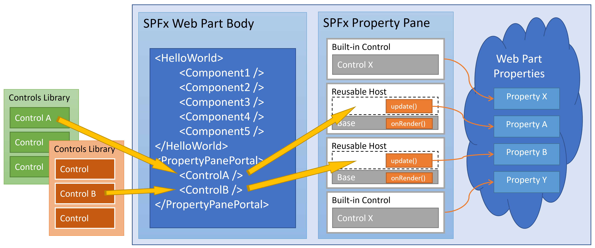

# Property Pane Portal

## Applies to

[SharePoint Framework](https://docs.microsoft.com/sharepoint/dev/spfx/sharepoint-framework-overview)

## Compatibility

 
 


-Incompatible-red.svg "SharePoint Server 2016 Feature Pack 2 requires SPFx 1.1")


## About the Property Pane Portal

For its forms, the [SPFx Property Pane](https://reactjs.org/docs/introducing-jsx.html) (PP) relies on a declarative model, not the standard XML used in HTML or [Reactjs JSX](https://reactjs.org/docs/introducing-jsx.html).

```typescript
groupFields: [
  PropertyPaneTextField('description', {label: strings.DescriptionFieldLabel}),
  PropertyPaneHorizontalRule(),
  PropertyPaneToggle('toggleProperty', toggleControlProperties),
  ...
```

This implementation is convenient for basic forms leveraging the built-in SPFx controls, for example for simple text input or static choices. However it adds complexity and hits limitations in real life scenarios that require more advanced forms, including dynamic controls, validation, or global state. Typically it requires you to work with two sets of controls, one for the Web Part body and one for the property pane. The PnP SPFx controls dual library ([SPFx React Controls](https://github.com/pnp/sp-dev-fx-controls-react) + [SPFx Property Controls](https://github.com/pnp/sp-dev-fx-property-controls)) is a great example.

The Property Pane Portal (PPP) aims at reinstating a more conventional XML approach to complex form building. No need for a dedicated PP controls library, the same Web controls you already use elsewhere can also run in the Property Pane. The PPP still integrates with the declarative model, and works side by side with the built-in SPFx PP controls (PropertyPaneTextField, etc.).



The package includes:
-	A generic control **PropertyPaneHost** for use in the Property Pane configuration
-	The **PropertyPanePortal** component whose job is to teleport a control to its Property Pane host

## How to Use the Package

In your SPFx solution, import the package:

```
npm i property-pane-portal
```

This will make the **PropertyPaneHost** function and the **PropertyPanePortal** component available to your solution.

See the list of samples for detailed implementation. Below the high level steps.

### PropertyPaneHost

1. Declare your custom property as you would usually do in HelloWorldWebPart.tsx.

2. Import PropertyPaneHost to HelloWorldWebPart:
```typescript
import { PropertyPaneHost } from 'property-pane-portal';
```
3. Use PropertyPaneHost as a placeholder in the Property Pane configuration:
```typescript
  protected getPropertyPaneConfiguration(): IPropertyPaneConfiguration {

    const hostProperties = ;

    return {
      pages: [
        {
          header: {
            description: strings.PropertyPaneDescription
          },
          groups: [
            {
              groupName: strings.BasicGroupName,
              groupFields: [
                PropertyPaneTextField('description', {label: strings.DescriptionFieldLabel}),
                PropertyPaneHorizontalRule(),
                PropertyPaneHost('customProperty', {context: this.context}),
                ...
```

### PropertyPanePortal

1. In the Web Part body:
Import the component:
```typescript
import { PropertyPanePortal } from 'property-pane-portal';
```

2. In the Web Part content:
-	Write the form controls as you would in the Web Part body or a Web page.
-	Add to each component a prop called data-property that contains the property name. PropertyPanePortal will use it to match the control to the Property Pane host.
-	Put all the controls in the PropertyPanePortal component. PropertyPanePortal will discard them when in run mode, and beam them to the Property Pane when in edit mode.

Example (JSX):
```jsx
      <PropertyPanePortal context={props.context}>
        <fieldset data-property="customProperty" >
          <label>Custom Property</label>
          <input
              type="text"
              value={props.properties["customProperty"]}
              onChange={(e: any) => props.updateWebPartProperty("customProperty", e.target.value)}
          />
        </fieldset>
      </PropertyPanePortal>
```

## Samples (work in progress)

-	PnP SPFx controls: showcase the use of the controls library for both Web Part body and Property Pane.
-	Fluent UI Northstar: showcase reuse of controls directly from the library samples.
-	HTML 5: showcase the use of HTML elements in the Property Pane.
-	MGT: showcase MGT components in the Property Pane.

## Real life implementation

An early version of the PPP was used to build the [inPerson Teams app](
https://appsource.microsoft.com/en-us/product/office/WA200002915?tab=Overview).

Note: as inPerson is a SPFx solution, you need to get it from the SharePoint Appsource, not the Microsoft Teams Appsource.

## Solution

Solution|Author(s)
--------|---------
property-pane-portal | [Christophe Humbert](https://github.com/PathToSharePoint)

## Version history

Version|Date|Comments
-------|----|--------
0.2.1|Jan 17, 2022|Expanded README

## Help

For issues, comments or questions, please reach out to Christophe on twitter ([Path2SharePoint](https://twitter.com/Path2SharePoint/)), github ([PathToSharePoint](https://github.com/PathToSharePoint)), or stackoverflow ([Christophe](https://stackoverflow.com/users/485406/christophe)) with the hashtag #PropertyPanePortal.

## Disclaimer

**THIS CODE IS PROVIDED *AS IS* WITHOUT WARRANTY OF ANY KIND, EITHER EXPRESS OR IMPLIED, INCLUDING ANY IMPLIED WARRANTIES OF FITNESS FOR A PARTICULAR PURPOSE, MERCHANTABILITY, OR NON-INFRINGEMENT.**